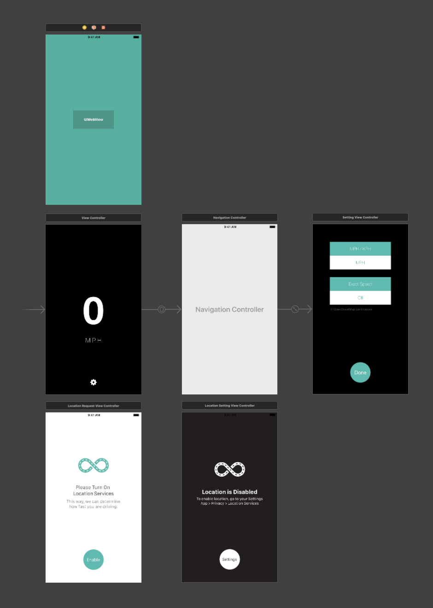

# Limit
iOS app written in Swift 3.0 in 2016.   

This app queries OpenStreetMap's API for road's speed limit as GPS location changes. This app aims to enchance road safety by informing additional information reguarding speed limit.  

Program Last modified: 2016-11-27  

